# DiffusionDrive-nusc 代码阅读与 nuScenes 跑通说明

检查对象：`C:/Users/Lenovo/Desktop/DiffusionDrive-nusc/`

结论先放前面：

1. 这份 `nusc` 分支代码具备跑 nuScenes 的核心链路，不是空壳。代码中有 nuScenes converter、Dataset、pipeline、SparseDrive/DiffusionDrive 模型头、planning eval、custom CUDA op 和基础训练/测试入口。
2. 它不能“下载后直接一键跑”。服务器上必须补齐环境、nuScenes 原始数据、CAN bus expansion、kmeans anchor、预训练权重，并修正/绕开几个陈旧脚本和可视化脚本问题。
3. 关键核心代码基本不缺，但关键运行资产和说明不完整：`ckpts/*.pth`、`data/kmeans/*.npy` 不在仓库内；`requirement.txt` 没列出完整 OpenMMLab/flash-attn/diffusers/einops/shapely 版本；`scripts/train.sh/test.sh/visualize.sh` 与当前 DiffusionDrive 配置不完全一致。
4. 最大的实际阻塞点是 planning anchor：配置需要 `data/kmeans/kmeans_plan_6.npy`，且模型按 3 个导航命令索引；当前 `tools/kmeans/kmeans_plan.py` 却保存 `kmeans_plan_vocab_6.npy`，形状/文件名都不匹配。要么从作者发布资产中拿正确文件，要么修 kmeans 脚本生成 `[3, 6, 6, 2]` 的 `kmeans_plan_6.npy`。

## 参考资料

- DiffusionDrive 论文/博客思路参考：<https://zhuanlan.zhihu.com/p/28192381036>
- nuScenes schema 官方文档：<https://github.com/nutonomy/nuscenes-devkit/blob/master/docs/schema_nuscenes.md>
- nuScenes CAN bus tutorial：<https://www.nuscenes.org/tutorials/can_bus_tutorial.html>
- DiffusionDrive 官方 nusc 分支：<https://github.com/hustvl/DiffusionDrive/tree/nusc>
- SparseDrive 环境准备参考：<https://github.com/swc-17/SparseDrive/blob/main/docs/quick_start.md>

## 一、代码结构脉络

```text
DiffusionDrive-nusc/
  README.md
  requirement.txt
  docs/train_eval.md
  scripts/
    create_data.sh
    kmeans.sh
    train.sh          # 陈旧，仍指 SparseDrive 路径
    test.sh           # 陈旧，仍指 SparseDrive 路径
    visualize.sh      # 陈旧，且可视化代码里有调试断点
  tools/
    train.py
    test.py
    dist_train.sh
    dist_test.sh
    data_converter/nuscenes_converter.py
    kmeans/*.py
    visualization/*.py
  projects/configs/
    diffusiondrive_configs/diffusiondrive_small_stage2.py
    sparsedrive_configs/sparsedrive_small_stage1.py
    sparsedrive_configs/sparsedrive_small_stage2.py
  projects/mmdet3d_plugin/
    datasets/nuscenes_3d_dataset.py
    datasets/pipelines/*.py
    datasets/map_utils/*.py
    datasets/evaluation/planning/planning_eval.py
    models/sparsedrive_v1.py
    models/sparsedrive_head_v1.py
    models/motion/motion_planning_head_v13.py
    models/motion/diff_motion_blocks.py
    models/motion/decoder.py
    ops/setup.py
```

核心数据流如下：

```mermaid
flowchart LR
  A["nuScenes raw data + maps + can_bus"] --> B["tools/data_converter/nuscenes_converter.py"]
  B --> C["data/infos/nuscenes_infos_train.pkl / val.pkl"]
  C --> D["NuScenes3DDataset"]
  D --> E["train/test pipeline: image, lidar depth, map, future traj, ego_status"]
  E --> F["V1SparseDrive + V1SparseDriveHead"]
  F --> G["V13MotionPlanningHead with DDIM truncated diffusion"]
  G --> H["HierarchicalPlanningDecoder: planning/final_planning"]
  H --> I["planning_eval: L2 / obj_box_col"]
```



## 二、能跑 nuScenes 的代码证据

### 1. 官方 README 明确发布 nuScenes 代码和权重

`README.md` 写明 2025-01-18 发布了 nuScenes code/weight，并有 nuScenes 结果表。代码证据：

- `README.md:21`：release initial version of code and weight on nuScenes。
- `README.md:56`：环境准备链接指向 SparseDrive quick start。
- `README.md:68-73`：有 nuScenes 结果表，列出 HF 权重和 GitHub log。

### 2. 配置已经是 nuScenes trainval 配置

`projects/configs/diffusiondrive_configs/diffusiondrive_small_stage2.py` 中：

- `:2-3` 先写 `version='mini'`，随后覆盖为 `version='trainval'`，实际默认是 full trainval。
- `:555-556` 数据根目录为 `data/nuscenes/`，标注 pkl 为 `data/infos/`。
- `:665-670` `use_camera=True`，其余 lidar/radar/map/external modality 为 False。
- `:673-680` Dataset 类型是 `NuScenes3DDataset`，version 是 `v1.0-trainval`。
- `:698-727` train/val/test 都指向 `nuscenes_infos_train.pkl` 或 `nuscenes_infos_val.pkl`。

注意：虽然 modality 写 `use_lidar=False`，训练 pipeline 仍加载 LIDAR 点云来生成深度监督：

- `:563-575` 训练 pipeline 包含 `LoadMultiViewImageFromFiles`、`LoadPointsFromFile`、`MultiScaleDepthMapGenerator`。

### 3. converter 能从原始 nuScenes 生成训练需要的信息

`tools/data_converter/nuscenes_converter.py` 中：

- `:90-92` 初始化 `NuScenes`、`NuscMapExtractor`、`NuScenesCanBus`。
- `:96-105` 支持 `v1.0-trainval`、`v1.0-test`、`v1.0-mini`。
- `:140-152` 输出 `nuscenes_infos_test.pkl` 或 `nuscenes_infos_train.pkl` / `nuscenes_infos_val.pkl`。
- `:255-272` 提取 HD map 几何并保存 `map_annos`。
- `:274-289` 收集 6 个相机：`CAM_FRONT`、`CAM_FRONT_RIGHT`、`CAM_FRONT_LEFT`、`CAM_BACK`、`CAM_BACK_LEFT`、`CAM_BACK_RIGHT`。
- `:405-410` 保存 agent future traj、自车 future traj、导航命令、`ego_status`。
- `:419-439` `ego_status` 从 CAN bus `pose` 和 `steeranglefeedback` 读加速度、角速度、速度、方向盘角；读不到会静默置零。

这与 nuScenes 官方 schema 是对齐的：nuScenes 用 `sample` 连接同一时间戳多传感器数据，`sample_data` 表指向图像/点云文件，`calibrated_sensor` 和 `ego_pose` 提供外参和自车位姿，`scene` 组织时序片段。代码正是沿这些 token 和外参表构造 camera/lidar/ego/global 变换。

### 4. Dataset 和 pipeline 字段完整

`projects/mmdet3d_plugin/datasets/nuscenes_3d_dataset.py`：

- `:298-312` `get_data_info()` 读取 token、map location、lidar path、sweeps、ego pose、`ego_status`、`map_annos`。
- `:328-358` 在 use_camera 时生成 `img_filename`、`lidar2img`、`lidar2cam`、`cam_intrinsic`。
- `:399-433` `get_ann_info()` 中包含 `gt_ego_fut_trajs`、`gt_ego_fut_masks`、`gt_ego_fut_cmd`、`fut_boxes`。
- `:818-878` `evaluate()` 支持 det、map、motion、planning，其中 planning 调用 `planning_eval()`。
- `:916-918` 最终打印 planning 的 `obj_box_col` 与 `L2`。

`projects/mmdet3d_plugin/datasets/pipelines/transform.py`：

- `:59-70` `NuScenesSparse4DAdaptor` 生成 `projection_mat`、`image_wh`、`T_global_inv` 等模型输入。
- `:99-110` 将 `gt_agent_fut_trajs`、`gt_ego_fut_trajs`、`gt_ego_fut_cmd`、`ego_status` 转成 tensor/DataContainer。

### 5. 模型核心不是缺失的

配置里模型是：

- `diffusiondrive_small_stage2.py:89` `type="V1SparseDrive"`。
- `:120-121` head 为 `V1SparseDriveHead`。
- `:399-407` motion/planning head 为 `V13MotionPlanningHead`，加载 `kmeans_motion_6.npy` 和 `kmeans_plan_6.npy`。
- `:431-447` `diff_operation_order` 里包含 `traj_pooler`、self attention、agent cross attention、anchor cross attention、modulation、`diff_refine`，重复 2 次。
- `:495-503` diffusion refine layer 是 `V4DiffMotionPlanningRefinementModule`。

模型代码证据：

- `models/sparsedrive_v1.py:27-47` 注册 `V1SparseDrive` 并 build backbone/neck/head。
- `models/sparsedrive_v1.py:98-104` 训练时 head 输出 loss，并叠加 dense depth loss。
- `models/sparsedrive_v1.py:114-120` 推理时调用 head 的 `post_process()`，返回 `img_bbox`。
- `models/sparsedrive_head_v1.py:14-31` `V1SparseDriveHead` 按 `task_config` 构建 det/map/motion_plan 三个 head。
- `models/sparsedrive_head_v1.py:56-64` motion_plan_head 接收 det/map 输出和 det anchor encoder。
- `models/sparsedrive_head_v1.py:106-122` post_process 合并 detection、map、motion、planning 结果。

Diffusion 部分证据：

- `models/motion/motion_planning_head_v13.py:31` 使用 `diffusers.schedulers.DDIMScheduler`。
- `:290-293` DDIM scheduler 设置 `num_train_timesteps=1000`、`scaled_linear`、`prediction_type="sample"`。
- `:1001-1012` 测试时 `step_num=2`，只滚动两个 denoise step，这对应论文/博客里的 truncated diffusion 思路。
- `:1031-1034` 从 command-specific plan anchor 加噪。
- `:1058-1118` 按 `diff_operation_order` 执行 denoise block，并调用 DDIM `step()`。
- `:1304-1325` post_process 调用 planning decoder。

Decoder 输出证据：

- `models/motion/decoder.py:111-148` `HierarchicalPlanningDecoder` 输出 `planning_score`、`planning`、`final_planning`。
- `models/motion/decoder.py:173-190` 根据 `gt_ego_fut_cmd` 选择三类导航命令中的当前命令，再选最高分轨迹。

### 6. planning eval 有实现

`projects/mmdet3d_plugin/datasets/evaluation/planning/planning_eval.py`：

- `:55-70` `PlanningMetric` 维护 `obj_col`、`obj_box_col`、`L2`。
- `:114-123` 更新 L2 和 collision。
- `:134-148` 对 val dataloader 逐样本读取 GT，自车预测来自 `res['img_bbox']['final_planning']`。
- `:153-176` 输出 0.5s 到 3.0s 和 avg 指标。

所以评测不是缺失的。

## 三、不能直接跑通的地方和证据

### 1. 运行资产缺失：权重和 anchor 不在仓库

本地仓库没有 `data/`、`ckpt/`、`ckpts/` 目录下的实际 `.pkl/.npy/.pth` 文件。配置硬依赖这些路径：

- `diffusiondrive_small_stage2.py:102` ResNet-50 预训练权重：`ckpts/resnet50-19c8e357.pth`。
- `:130` det anchor：`data/kmeans/kmeans_det_900.npy`。
- `:275` map anchor：`data/kmeans/kmeans_map_100.npy`。
- `:406-407` motion/plan anchor：`data/kmeans/kmeans_motion_6.npy`、`data/kmeans/kmeans_plan_6.npy`。
- `:768` stage2 训练从 `ckpts/sparsedrive_stage1.pth` 加载。
- `docs/train_eval.md:31` 官方 eval 示例用 `ckpt/diffusiondrive_stage2.pth`，但配置中其他地方用 `ckpts/`，存在 `ckpt`/`ckpts` 命名不一致。

服务器需要自行放置或下载：

```text
ckpts/resnet50-19c8e357.pth
ckpts/sparsedrive_stage1.pth
ckpts/diffusiondrive_stage2.pth 或 ckpt/diffusiondrive_stage2.pth
data/kmeans/kmeans_det_900.npy
data/kmeans/kmeans_map_100.npy
data/kmeans/kmeans_motion_6.npy
data/kmeans/kmeans_plan_6.npy
```

### 2. planning kmeans 脚本与配置不匹配，这是高优先级坑

配置要求：

- `diffusiondrive_small_stage2.py:407` 加载 `data/kmeans/kmeans_plan_6.npy`。
- `motion_planning_head_v13.py:886-887` 将 `self.plan_anchor` tile 到 batch。
- `motion_planning_head_v13.py:1018-1025` 使用 `gt_ego_fut_cmd` 在 plan_anchor 的命令维度上索引。

但 `tools/kmeans/kmeans_plan.py`：

- `:13` 读取 `data/infos/nuscenes_infos_train.pkl`。
- `:20-22` 虽然计算了 `cmd`，但没有按 `cmd` 分组。
- `:31-32` 聚类输出形状是 `[6, 6, 2]`。
- `:40` 保存成 `data/kmeans/kmeans_plan_vocab_6.npy`，不是配置需要的 `kmeans_plan_6.npy`。

正确方案：

1. 优先从作者发布的 HF/release 资产中拿 `kmeans_plan_6.npy`。
2. 如果服务器端自己生成，修改脚本为按 `gt_ego_fut_cmd` 三类命令分别聚类，最后保存：

```python
# 目标形状: [3, K, 6, 2], K=6
np.save("data/kmeans/kmeans_plan_6.npy", np.stack(clusters, axis=0))
```

不要简单把 `kmeans_plan_vocab_6.npy` 重命名为 `kmeans_plan_6.npy`，否则三命令索引可能越界或语义错误。

### 3. `scripts/train.sh` / `scripts/test.sh` 是陈旧 SparseDrive 脚本

证据：

- `scripts/train.sh:3` 指向 `projects/configs/sparsedrive_small_stage1.py`，但实际文件在 `projects/configs/sparsedrive_configs/`。
- `scripts/train.sh:9` 指向 `projects/configs/sparsedrive_small_stage2.py`，不是 DiffusionDrive 配置。
- `scripts/test.sh:2-3` 指向 `projects/configs/sparsedrive_small_stage2.py` 和 `ckpt/sparsedrive_stage2.pth`。
- `scripts/visualize.sh:3-4` 也指向 SparseDrive 配置和 `work_dirs/sparsedrive_small_stage2/results.pkl`。

训练/评测应以 `docs/train_eval.md` 的 DiffusionDrive 配置为准：

```bash
projects/configs/diffusiondrive_configs/diffusiondrive_small_stage2.py
```

### 4. 可视化脚本不是可直接批量运行状态

`tools/visualization/visualize.py`：

- `:50` camera render 被注释：`# cam_pred_path = self.cam_render.render(...)`。
- `:52` 只调用了 BEV render。
- `:54` 有 `import ipdb; ipdb.set_trace()`。
- `:55` 又使用未定义的 `cam_pred_path`。

`tools/visualization/bev_render.py`：

- `:104-105` hard-code 了 `/home/users/bencheng.liao/PlanWrapper/data/kmeans/kmeans_plan_6.npy`。
- `:141` 有 `import ipdb; ipdb.set_trace()`。
- `:119-141` `render()` 当前只返回一个 `save_path_gt`，但 `visualize.py` 期待两个返回值 `bev_gt_path, bev_pred_path`。

因此，模型训练/评测可以跑；但若要服务器批量出图，必须先修可视化脚本。

### 5. requirements 不完整

`requirement.txt` 只列了：

```text
numpy==1.23.5
mmdet==2.28.2
urllib3==1.26.16
pyquaternion==0.9.9
nuscenes-devkit==1.1.10
yapf==0.33.0
tensorboard==2.14.0
motmetrics==1.1.3
pandas==1.1.5
opencv-python==4.8.1.78
prettytable==3.7.0
scikit-learn==1.3.0
```

但代码还需要：

- `torch` / CUDA 对应版本。
- `mmcv-full` 或兼容 mmcv。
- `mmdet3d`。
- `diffusers`：`motion_planning_head_v13.py:31`、`bev_render.py:9`。
- `flash-attn`：`models/attention.py:17-24` 无有效 fallback，缺了会 import 失败。
- `einops`：`models/attention.py` 使用。
- `shapely`：Dataset/map/planning eval 使用；建议 pin `shapely<2` 或 `shapely==1.8.5.post1`，因为 map extractor 里使用了 Shapely 1.x 风格的 `STRtree.query()` 返回 geometry 行为。
- `matplotlib`、`Pillow`、`tqdm` 等脚本依赖。

### 6. custom CUDA op 必须编译

配置里：

- `diffusiondrive_small_stage2.py:70` `use_deformable_func=True`，注释写明 `mmdet3d_plugin/ops/setup.py needs to be executed`。

源码证据：

- `projects/mmdet3d_plugin/ops/setup.py:47-55` 构建 `deformable_aggregation_ext`，源文件是 `src/deformable_aggregation.cpp` 和 `src/deformable_aggregation_cuda.cu`。
- `models/sparsedrive_v1.py:49-50` 如果 `use_deformable_func=True` 但 DAF 不可用，会 assert：`deformable_aggregation needs to be set up.`

服务器上需要：

```bash
cd projects/mmdet3d_plugin/ops
python setup.py build install
cd ../../..
```

如果编译失败，临时可把配置中 `use_deformable_func=False` 做功能验证，但速度、显存和结果可能与论文/权重不一致，不建议作为最终复现实验。

### 7. full trainval 与 mini 模式需要显式区分

配置默认 full trainval：

- `diffusiondrive_small_stage2.py:2-3` `mini` 被 `trainval` 覆盖。
- `:556` full 用 `data/infos/`，mini 用 `data/infos/mini/`。

`scripts/create_data.sh` 会先生成 mini，再生成 full：

```bash
python tools/data_converter/nuscenes_converter.py nuscenes --version v1.0-mini ...
python tools/data_converter/nuscenes_converter.py nuscenes --version v1.0 ...
```

如果服务器只想 smoke test mini，需要复制一个 mini config，把 `version = 'trainval'` 改成 `version = 'mini'`，否则代码会找 full 的 `data/infos/nuscenes_infos_train.pkl`。

### 8. Linux/分布式假设

- `tools/train.py:318-320` 和 `tools/test.py:322-324` 使用 `torch.multiprocessing.set_start_method("fork")`，这是 Linux 假设。服务器通常没问题，本机 Windows 不适合直接跑完整训练。
- `tools/dist_train.sh` / `tools/dist_test.sh` 使用旧的 `torch.distributed.launch`。新 PyTorch 建议改为 `torch.distributed.run`，`docs/train_eval.md` 训练示例已经使用 `torch.distributed.run`。

### 9. numpy 版本不能随便升

`nuscenes_3d_dataset.py:392` 使用 `np.int`，`numpy>=1.24` 会报错。`requirement.txt` pin 了 `numpy==1.23.5`，服务器如果用新版 numpy，要 patch 成 `int` 或 `np.int64`。

## 四、服务器推荐跑通流程

以下命令假设在 Linux 服务器 repo 根目录运行。

### 0. 获取 nusc 分支

```bash
git clone -b nusc --single-branch https://github.com/hustvl/DiffusionDrive.git DiffusionDrive-nusc
cd DiffusionDrive-nusc
export PYTHONPATH=$PWD:$PYTHONPATH
```

### 1. 准备环境

优先照 SparseDrive quick start 配 OpenMMLab 栈，然后补 DiffusionDrive-nusc 依赖。

```bash
pip install -r requirement.txt

# requirement.txt 未覆盖但代码需要的依赖，版本按服务器 torch/cu 选择
pip install diffusers einops tqdm matplotlib pillow

# 建议 pin shapely 1.x，避免 STRtree 行为差异
pip install "shapely<2"

# flash-attn 需与 torch / CUDA / Python 匹配
pip install flash-attn --no-build-isolation
```

OpenMMLab 需要服务器端按 CUDA/Torch 选择兼容版本安装：

```bash
# 示例，不要无脑复制版本，按 SparseDrive quick_start 和本机 CUDA/Torch 适配
pip install mmcv-full ...
pip install mmdet3d ...
```

### 2. 编译 deformable aggregation op

```bash
cd projects/mmdet3d_plugin/ops
python setup.py build install
cd ../../..
```

检查方式：

```bash
python -c "from projects.mmdet3d_plugin.ops import deformable_aggregation_function; print('op ok')"
```

### 3. 准备 nuScenes 数据

推荐目录：

```text
data/nuscenes/
  samples/
  sweeps/
  maps/
  v1.0-trainval/
  v1.0-test/              # 可选，本地 val 评测不需要 test GT
  can_bus/                # CAN bus expansion 解压到这里
```

注意点：

- `samples` 和 `sweeps` 要包含 6 路 camera 和 `LIDAR_TOP`。
- `maps` 要完整，否则 `NuscMapExtractor` 会失败。
- `can_bus` 最好完整，否则 converter 不会中断，但 `ego_status` 会被置零，规划模型会少一类输入信号。
- 本地可评测的是 val split；official test split 没 GT，不适合本地算 L2/collision。

### 4. 生成 info pkl

full trainval：

```bash
python tools/data_converter/nuscenes_converter.py nuscenes \
  --root-path ./data/nuscenes \
  --canbus ./data/nuscenes \
  --out-dir ./data/infos/ \
  --extra-tag nuscenes \
  --version v1.0
```

生成后应有：

```text
data/infos/nuscenes_infos_train.pkl
data/infos/nuscenes_infos_val.pkl
data/infos/nuscenes_infos_test.pkl
```

mini smoke test：

```bash
python tools/data_converter/nuscenes_converter.py nuscenes \
  --root-path ./data/nuscenes \
  --canbus ./data/nuscenes \
  --out-dir ./data/infos/ \
  --extra-tag nuscenes \
  --version v1.0-mini
```

mini 输出在：

```text
data/infos/mini/nuscenes_infos_train.pkl
data/infos/mini/nuscenes_infos_val.pkl
```

### 5. 准备 kmeans anchors

需要的文件：

```text
data/kmeans/kmeans_det_900.npy
data/kmeans/kmeans_map_100.npy
data/kmeans/kmeans_motion_6.npy
data/kmeans/kmeans_plan_6.npy
```

可以先跑：

```bash
mkdir -p data/kmeans vis/kmeans
python tools/kmeans/kmeans_det.py
python tools/kmeans/kmeans_map.py
python tools/kmeans/kmeans_motion.py
```

planning anchor 不建议直接跑原始 `kmeans_plan.py` 后重命名。应修成按三类命令聚类：

```python
K = 6
navi_trajs = [[], [], []]
for info in data_infos:
    plan_traj = info["gt_ego_fut_trajs"].cumsum(axis=-2)
    plan_mask = info["gt_ego_fut_masks"]
    cmd = info["gt_ego_fut_cmd"].astype(np.int32).argmax(axis=-1)
    if plan_mask.sum() != 6:
        continue
    navi_trajs[cmd].append(plan_traj)

clusters = []
for cmd_trajs in navi_trajs:
    trajs = np.concatenate(cmd_trajs, axis=0).reshape(-1, 12)
    cluster = KMeans(n_clusters=K).fit(trajs).cluster_centers_.reshape(K, 6, 2)
    clusters.append(cluster)

np.save("data/kmeans/kmeans_plan_6.npy", np.stack(clusters, axis=0))
```

生成后检查形状：

```bash
python - <<'PY'
import numpy as np
for p in [
  "data/kmeans/kmeans_det_900.npy",
  "data/kmeans/kmeans_map_100.npy",
  "data/kmeans/kmeans_motion_6.npy",
  "data/kmeans/kmeans_plan_6.npy",
]:
    x = np.load(p)
    print(p, x.shape)
PY
```

期望大致为：

```text
kmeans_det_900.npy     (900, 11)
kmeans_map_100.npy     (100, 20, 2)
kmeans_motion_6.npy    (10, 6, 12, 2)
kmeans_plan_6.npy      (3, 6, 6, 2)
```

### 6. 准备权重

```bash
mkdir -p ckpts
```

至少需要：

```text
ckpts/resnet50-19c8e357.pth
ckpts/sparsedrive_stage1.pth
```

`docs/train_eval.md` 里 stage1 ckpt 来源：

```bash
wget https://github.com/swc-17/SparseDrive/releases/download/v1.0/sparsedrive_stage1.pth \
  -O ckpts/sparsedrive_stage1.pth
```

DiffusionDrive stage2 eval 权重可从官方 README 表中的 HF/release 获取。注意文档示例写 `ckpt/diffusiondrive_stage2.pth`，而配置常用 `ckpts/`。建议统一为：

```text
ckpts/diffusiondrive_stage2.pth
```

并在命令里用这个路径。

### 7. 训练

官方文档推荐：

```bash
export WORK_DIR="/job_data/work_dirs/diffusiondrive_nusc"
export GPUS=8
export CONFIG="./projects/configs/diffusiondrive_configs/diffusiondrive_small_stage2.py"

python -m torch.distributed.run \
  --nproc_per_node=${GPUS} \
  --master_port=2333 \
  tools/train.py ${CONFIG} \
  --launcher pytorch \
  --deterministic \
  --work-dir ${WORK_DIR}
```

GPU 数不是 8 时：

- 配置中 `total_batch_size=48`、`num_gpus=8`、`batch_size=6`、`workers_per_gpu=6`。
- 这些变量在 config import 时已经算好，单独 `--cfg-options num_gpus=...` 不一定会重算 `batch_size` 和 iter 数。
- 推荐复制一份 server config，例如 `diffusiondrive_small_stage2_server.py`，手动改：

```python
total_batch_size = 48   # 或改小
num_gpus = 4
batch_size = total_batch_size // num_gpus
```

如果显存不足，优先降 `batch_size`，同时相应调整 lr 或训练步数。

### 8. 评测

```bash
bash ./tools/dist_test.sh \
  projects/configs/diffusiondrive_configs/diffusiondrive_small_stage2.py \
  ckpts/diffusiondrive_stage2.pth \
  8 \
  --deterministic \
  --eval bbox
```

说明：

- 虽然 `--eval bbox` 名字像 detection，但真正 eval 内容由 config 的 `eval_mode` 控制。
- `diffusiondrive_small_stage2.py:754-760` 中 `with_planning=True`，det/map/motion 都是 False，所以主要输出 planning L2 / collision。
- `NuScenes3DDataset.evaluate()` 会把全部结果保存到 `work_dir/results.pkl`。

如果只想从已有结果 pkl 评测：

```bash
python tools/test.py \
  projects/configs/diffusiondrive_configs/diffusiondrive_small_stage2.py \
  ckpts/diffusiondrive_stage2.pth \
  --result_file /path/to/results.pkl \
  --eval bbox
```

## 五、可视化注意事项

### 1. Dataset 自带 `show()` 可作为更稳的起点

`tools/test.py` 支持 `--show` / `--show-dir`，最终 `NuScenes3DDataset.evaluate()` 会调用 `dataset.show()`：

- `nuscenes_3d_dataset.py:880-881`：`if show or out_dir: self.show(...)`。
- `:923-930`：输出到 `save_dir/visual`。

但这个 `show()` 更偏 detection/BEV 视频，不一定完整展示 planning diffusion 的中间过程。

### 2. `tools/visualization` 需要先修

如果要用 `tools/visualization/visualize.py`：

必须修：

1. 删除 `visualize.py:54`、`bev_render.py:141` 的 `ipdb.set_trace()`。
2. `bev_render.py:105` 的 hard-code 路径改成 repo 相对路径：

```python
self.vocabulary = np.load("data/kmeans/kmeans_plan_6.npy")
```

3. `BEVRender.render()` 当前只返回 `save_path_gt`，而 `visualize.py` 期待 `bev_gt_path, bev_pred_path`；要么只保存 BEV GT，要么补齐 pred render 返回。
4. `visualize.py:50` camera render 被注释，`cam_pred_path` 未定义；如果要合成 camera+BEV，恢复：

```python
cam_pred_path = self.cam_render.render(data, result, index)
```

5. `cam_render.py:54-65` 默认也注释掉 detection/motion/planning 绘制；若要看预测轨迹，打开：

```python
self.draw_detection_pred(data, result)
self.draw_motion_pred(data, result)
self.draw_planning_pred(data, result)
```

### 3. planning 坐标和命令细节

- converter 保存的 `gt_ego_fut_trajs` 是每 0.5s 的 offset，不是累计坐标；eval/visualization 多处会 `cumsum()`。
- `gt_ego_fut_cmd` 是 one-hot，规则来自 converter：
  - final x >= 2：Turn Right
  - final x <= -2：Turn Left
  - otherwise：Go Straight
- decoder 根据 `gt_ego_fut_cmd` 选择当前命令的 plan modes。可视化时如果用预测命令或真实命令要保持一致，否则会画到错误 command branch。
- planning eval 内部会对 x 轴做符号翻转以匹配 collision 坐标系，别把图上的 x/y 和 eval 里的 x/y 直接混为一谈。

### 4. 预测鸟瞰图/BEV 坐标系转换注意事项

这份代码的 BEV 可视化、规划预测和 planning eval 基本都落在“当前帧 `LIDAR_TOP` 局部坐标系”中，而不是 nuScenes global 坐标系。服务器端做预测鸟瞰图时要先统一这一点。

nuScenes 原始标定链路：

```text
sensor frame --sensor2ego--> ego frame --ego2global--> global/map frame
```

当前代码里的关键实现：

- converter 从 nuScenes `calibrated_sensor` 和 `ego_pose` 取当前 `LIDAR_TOP` 的 `lidar2ego_translation/rotation` 与 `ego2global_translation/rotation`。
- `nuscenes_converter.py:256-266` 计算 `lidar2global = ego2global @ lidar2ego`，并用它从地图中抽取当前局部 patch。
- `nuscenes_converter.py:365-385` 先取未来每一帧的 global sensor pose，再变换回“当前帧 ego”，再变换回“当前帧 lidar”。
- `nuscenes_converter.py:394-408` 最终保存的 `gt_ego_fut_trajs` 是当前 lidar 坐标系下的逐步 offset，只保留 `[x, y]`。
- `nuscenes_3d_dataset.py:313-323` Dataset 再构造当前帧 `lidar2global`。
- `nuscenes_3d_dataset.py:336-348` Dataset 构造 `lidar2cam` 和 `lidar2img`，供相机投影和模型跨视角特征采样使用。

因此，画 BEV 时推荐约定：

```text
BEV 原点: 当前自车/LIDAR_TOP 原点
x: 当前车体前向
y: 当前车体左向
z: 上方，仅 3D box/camera 投影用；2D BEV 主要用 x-y
```

这与 nuScenes 常用 ego/lidar 坐标一致：自车前方为正 x，左侧为正 y。不要把 global map 的 x/y 直接拿来画预测轨迹；global 坐标必须先通过当前帧 `global2ego/global2lidar` 转回局部坐标。

预测 planning 的字段含义：

```text
result["planning"]        # shape 约为 [3, ego_fut_mode, 6, 2]，3 是 Turn Right / Turn Left / Go Straight
result["planning_score"]  # shape 约为 [3, ego_fut_mode]
result["final_planning"]  # shape [6, 2]，decoder 已按当前 command 和最高分 mode 选出的最终轨迹
```

注意：`decoder.py:134-148` 中已经对 `prediction` 做了 `cumsum(dim=-2)`，所以 `result["planning"]` 和 `result["final_planning"]` 是累计后的未来点坐标，不再是 offset。相反，GT `data["gt_ego_fut_trajs"]` 仍是 offset，可视化 GT 时要像 `bev_render.py:370-375` 那样先 `cumsum(axis=0)` 再补 `[0, 0]` 起点。

BEV 渲染细节：

- `bev_render.py:115-116` 当前画布范围是 `xlim=(-17, 17)`、`ylim=(-32, 32)`，和 config 的 `roi_size=(30, 60)` 接近但不完全一样；如果改 ROI 或想显示更远规划，需要同步调大画布。
- `bev_render.py:196-217` detection GT 直接取 3D box corners 的 x/y 画在 BEV 上。
- `bev_render.py:337-347` map GT 直接画 `map_infos` 的局部 x/y；这些 map vector 已由 converter/NuscMapExtractor 按当前局部 patch 处理。
- `bev_render.py:751-790` planning pred 使用 `result["planning"]` 和 `result["planning_score"]` 画 top-k 轨迹，命令来自 `data["gt_ego_fut_cmd"].argmax()`。
- `cam_render.py:251-257` camera 图里的 planning 轨迹会把 `final_planning` 补 z=-1.8 后乘 `lidar2cam` 外参，再用相机内参投影；BEV 图不需要做相机投影。

常见错误：

1. 把 `gt_ego_fut_trajs` 当绝对轨迹点画，导致轨迹挤在原点附近。正确做法是 `cumsum`。
2. 把 `final_planning` 再 `cumsum` 一次，导致预测轨迹被错误拉长。`final_planning` 已经是累计点。
3. 把 nuScenes global 坐标直接叠到局部 BEV，导致地图、box、轨迹全部偏移。必须用当前帧 pose 转回 lidar/ego local。
4. 混淆 y 轴方向。代码按数学坐标画 BEV，正 y 是车辆左侧；如果后处理成图像像素坐标，图像向下是正 v，需要自行翻转或明确显示约定。
5. collision eval 中有额外 x 轴符号处理，不能直接用 eval 内部张量作为可视化坐标。

## 六、建议服务器 AI 先做的检查清单

在正式训练前，建议执行以下检查。

### 1. 路径检查

```bash
test -f data/infos/nuscenes_infos_train.pkl
test -f data/infos/nuscenes_infos_val.pkl
test -f data/kmeans/kmeans_det_900.npy
test -f data/kmeans/kmeans_map_100.npy
test -f data/kmeans/kmeans_motion_6.npy
test -f data/kmeans/kmeans_plan_6.npy
test -f ckpts/resnet50-19c8e357.pth
test -f ckpts/sparsedrive_stage1.pth
```

### 2. anchor shape 检查

```bash
python - <<'PY'
import numpy as np
checks = {
  "data/kmeans/kmeans_det_900.npy": (900, 11),
  "data/kmeans/kmeans_map_100.npy": (100, 20, 2),
  "data/kmeans/kmeans_motion_6.npy": (10, 6, 12, 2),
  "data/kmeans/kmeans_plan_6.npy": (3, 6, 6, 2),
}
for path, expected in checks.items():
    arr = np.load(path)
    print(path, arr.shape)
    assert arr.shape == expected, (path, arr.shape, expected)
PY
```

### 3. 环境 import 检查

```bash
python - <<'PY'
import torch
import mmcv
import mmdet
import mmdet3d
import diffusers
import flash_attn
import nuscenes
import shapely
print("torch", torch.__version__, "cuda", torch.version.cuda, torch.cuda.is_available())
print("mmcv", mmcv.__version__)
print("mmdet", mmdet.__version__)
print("env ok")
PY
```

### 4. 插件和 op 检查

```bash
python - <<'PY'
import projects.mmdet3d_plugin
from projects.mmdet3d_plugin.ops import deformable_aggregation_function
print("plugin/op ok")
PY
```

### 5. Dataset 构建检查

```bash
python - <<'PY'
from mmcv import Config
from mmdet.datasets import build_dataset
import projects.mmdet3d_plugin
cfg = Config.fromfile("projects/configs/diffusiondrive_configs/diffusiondrive_small_stage2.py")
ds = build_dataset(cfg.data.val)
print("len", len(ds))
item = ds.get_data_info(0)
for k in ["img_filename", "lidar2img", "ego_status", "gt_ego_fut_trajs", "gt_ego_fut_cmd", "map_infos"]:
    print(k, type(item.get(k)))
PY
```

如果这里失败，先修数据路径、pkl、map/CAN bus，不要直接开训练。

## 七、最终判断

可以利用该代码跑通 nuScenes，但前提是使用 `nusc` 分支，且服务器端按上面的资产和路径准备完整。

代码不缺主要核心实现：

- nuScenes 数据转换：有。
- nuScenes Dataset/pipeline：有。
- map/vector、agent future、自车 planning GT：有。
- DiffusionDrive planning head：有。
- DDIM truncated diffusion 推理：有。
- planning eval：有。
- 训练/评测入口：有。
- custom CUDA op 源码：有。

但以下内容不是“代码核心缺失”，而是“复现运行必须补齐/修正”的问题：

- 权重和 kmeans anchor 文件未随仓库提供。
- `kmeans_plan.py` 与当前 config/model 不匹配，需要修或下载正确 `kmeans_plan_6.npy`。
- requirements 缺少完整 OpenMMLab、flash-attn、diffusers、einops、shapely 版本说明。
- `scripts/train.sh/test.sh/visualize.sh` 陈旧，不应直接作为 DiffusionDrive-nusc 入口。
- 可视化工具里存在 hard-code 路径、调试断点和返回值不匹配。
- 需要 CAN bus expansion，否则 `ego_status` 被置零，可能影响规划效果。
- 需要 Linux/CUDA 编译 custom op；Windows 本地不适合完整跑。

本地做过轻量语法检查：`train.py`、`test.py`、converter、Dataset、motion planning head、diffusion blocks、decoder、visualization 关键 Python 文件均通过 `py_compile`。这只说明语法层面完整，不代表本机已安装依赖或已跑训练。
